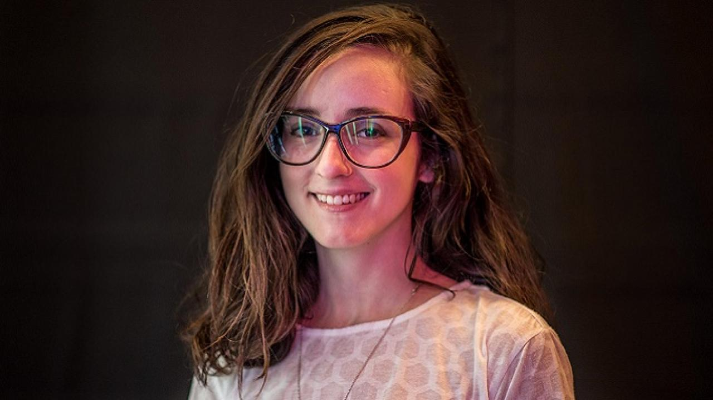

# Nuestras coders:
 1. Creamos una estructura html
 2. Ponemos un titulo de la pagina en este caso seria dentro de < head >

           <title>Nuestras Coders<title>

    tambien se enlaza el html con el css
         <link rel="stylesheet" href="css/main.css">
 3. En el *body* colocamos un titulo
           <h2>Nuestras coders</h2>
    se coloca una linea
               

      colocar imagenes dentro un div
             

        

        

        
cortamos con un br para que la imagen baje a la siguiente bloque
           

  luego seguimos colocando las imagenes                         
          

           

           

  ponemos los nombres y apellidos con un div y su class
            
Ana Vega

            
Lucia Torres 

            
Sofia Gomez 

            
Teresa Martinez 

            
Romina Escobar 

            
Juliana Caceres 

se cierra todo con el  < /div>
 4. y cerramos el body y html
 5. Dentro del css es
 Ponemos  un body dentro cambiamos la fuente y su color S
        body{  font-family:monospace;
               color:#6D6766; }
  con el hr que es la linea sola lo modificamos para que sea mas pequeño el grosor tambien y la position

         hr{
                width: 70px;
                margin-left: 0px;
                border:2px #6D6766 solid;
                bottom:10px;
                position: relative;
              }
 dentro de la img se hace los cambia a todas las imagenes que colocamos para que esten ordenadas y tengan mismo tamaño
           img{  height: 200px;
                 width: 270px;
                 margin-left: 20px;
                 margin-bottom: 20px;
                 position: relative;
                }
ya aqui modificamos cada texto para que este encima de las imagenes se puso una position absolute para que pueda entrar sin problemas dentro de la imagen y ya se modifica lo demas el color el margen tamaño
          .text_1{
                 position: absolute;
                 top:210px;
                 margin-left: 40px;
                 font-size: 2em;
                 color: orange;
          }
         .text_2{
                position: absolute;
                top:210px;
                margin-left: 400px;
                font-size: 2em;
                color: orange;
                }
         .text_3{
               position: absolute;
               top:210px;
               margin-left: 720px;
               font-size: 2em;
               color: orange;}

         .text_4{ position: absolute;
               bottom:180px;
               margin-left: 60px;
               font-size: 2em;
               color: orange;}

         .text_5{ position: absolute;
               bottom:180px;
               margin-left: 380px;
               font-size: 2em;
               color: orange;
              }
          .text_6{ position: absolute;
               bottom:180px;
               margin-left: 660px;
               font-size: 2em;
               color: orange;
               }
